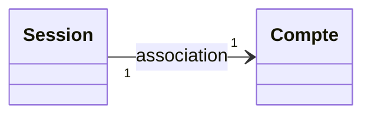
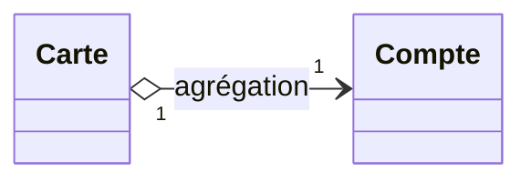
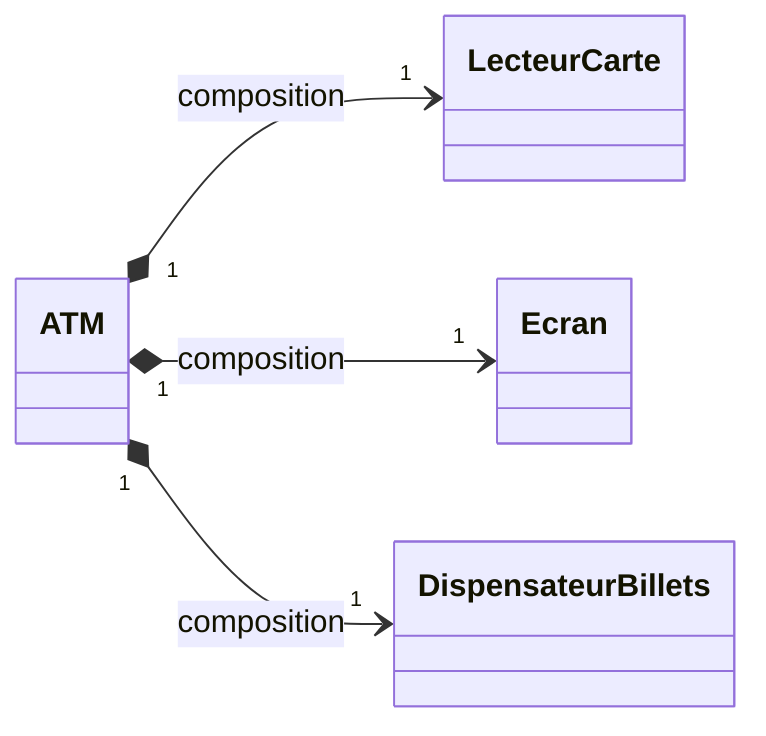
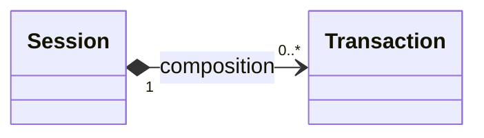
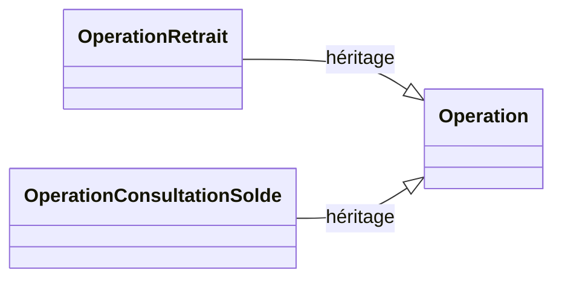
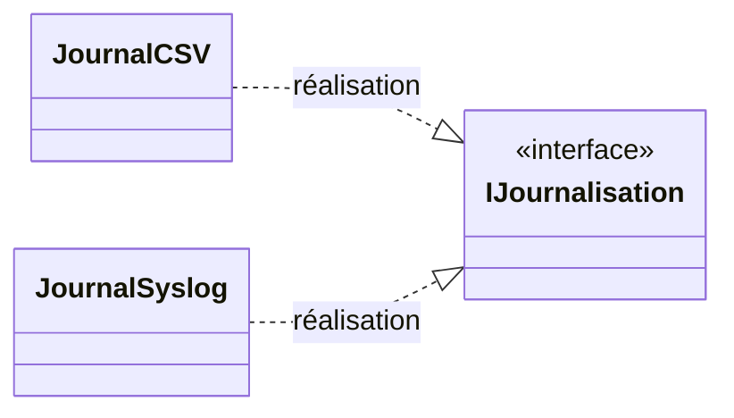
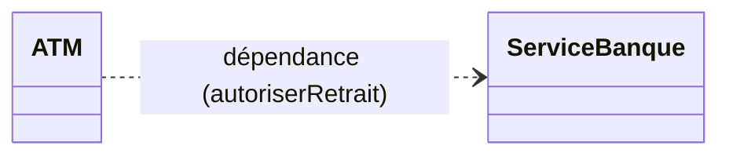
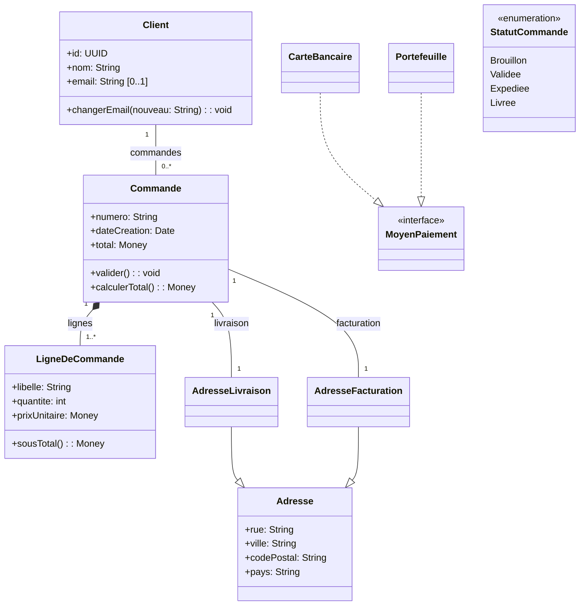

# Diagramme de classes (UML)

## Objectifs du cours
- Comprendre le rôle du diagramme de classes dans la modélisation orientée objet.
- Savoir lire, concevoir et documenter un diagramme de classes conforme à l’UML.
- Maîtriser les principaux éléments (classes, attributs, opérations) et relations (association, agrégation, composition, héritage, dépendance, réalisation).
- Appliquer les bonnes pratiques de nommage, de structuration et de présentation.

---

## 1) Rappel: où s’inscrit le diagramme de classes dans l’UML ?
Le diagramme de classes fait partie des diagrammes structurels de l’UML. Il décrit la structure statique du système:
- Concepts métier (classes), caractéristiques (attributs), comportements (opérations/méthodes).
- Relations entre concepts (associations, généralisations, compositions, etc.).
- Contrats (interfaces), types simples (énumérations, types primitifs).
Il sert de base à l’implémentation (modèle de domaine, modèles objets) et complète les diagrammes comportementaux (cas d’utilisation, séquences, états, activités).

---

## 2) Éléments de base

### 2.1 Classe
Représentée par un rectangle en 1 à 3 compartiments:
- Nom de la classe (obligatoire).
- Attributs (facultatif).
- Opérations (facultatif).

Exemple (notation textuelle):
- Classe: `Client`
- Attributs: `+id: UUID`, `+nom: String`, `+email: String [0..1]`
- Opérations: `+changerEmail(nouveau: String): void`

### 2.2 Visibilité
- `+` public: accessible partout.
- `#` protégé: accessible par la classe et ses sous-classes.
- `-` privé: accessible uniquement par la classe.
- `~` package: accessible au sein du même paquetage.

### 2.3 Attributs
- Syntaxe: `visibilité nom: Type multiplicité = valeurParDéfaut {propriétés}`
- Propriétés fréquentes: `{readOnly}`, `{static}`, `{derived}`.
- Attribut dérivé: précédé d’un `/`, p.ex. `/age: int`.

### 2.4 Opérations (méthodes)
- Syntaxe: `visibilité nom(param1: Type, param2: Type = défaut): TypeRetour {propriétés}`
- Modificateurs fréquents: `{abstract}`, `{static}`, `{query}`.

### 2.5 Types et stéréotypes
- Types primitifs (String, int, boolean...), types valeur (Money, Date), énumérations, classes, interfaces.
- Stéréotypes (entre guillemets français « » ou anglais « »): p.ex. «entity», «service», «valueObject».

---

## 3) Relations entre classes

Dans un système orienté objet, les classes coopèrent pour rendre un service. Les liens entre classes capturent ces coopérations. On distingue six relations de base en UML, qui se différencient par leur intention (avoir/utiliser/être), leur durée (durable/temporaire) et leur notation.

Relation | Intention | Durée | Cardinalité | Notation UML
---|---|---|---|---
Association | « avoir / collaborer avec » | durable | oui | Trait plein (flèches pour la navigabilité)
Agrégation | « a des (parties partageables) » | durable | oui | Trait plein + losange vide côté agrégat
Composition | « est composé de (parts non partageables) » | durable | oui | Trait plein + losange plein côté composite
Généralisation (Héritage) | « est-un » | durable | non | Flèche triangle blanc vers la super-classe
Réalisation (classe → interface) | « s’engage à fournir » | durable | non | Triangle blanc en pointillé vers l’interface
Dépendance | « utilise ponctuellement » | temporaire | non | Flèche pointillée vers l’élément utilisé

Conseils pratiques
- Cardinalités: 0..1, 1, 0..*, 1..*, 1..n, * (non borné).
- Rôles: nommer chaque extrémité clarifie la lecture (ex. « carte », « transactions »).
- Navigabilité: flèche(s) si un seul sens; sans flèche = bidirectionnel.
- Choisir la relation la plus faible qui transmet l’intention: préférer l’association à l’agrégation, et l’agrégation à la composition, sauf nécessité.

---

### 3.1 Association

Une association exprime un lien sémantique durable entre classes. Elle peut être bidirectionnelle ou unidirectionnelle (navigabilité). On y précise les rôles et les multiplicité(s).

Exemple (ATM): une Session est liée au Compte authentifié pendant l’opération.

Notes
- Rôle côté Compte: « compteCourant » (du point de vue de Session).
- Navigabilité unidirectionnelle: Session connaît le Compte; l’inverse n’est pas nécessaire.
- Cardinalité «1–1» car une session authentifiée travaille sur un seul compte.

---

### 3.2 Agrégation (losange vide)

L’agrégation est une relation «partie–tout» faible: les parties peuvent exister indépendamment et être partagées. À utiliser avec parcimonie; souvent une simple association suffit.

Exemple (ATM): une Carte référence un Compte; le Compte existe sans la Carte et peut être relié à plusieurs cartes (compte joint, duplicata).

Notes
- Le « tout » (agrégat) est la Carte ici (notation mermaid côté source).
- Le Compte n’est pas détruit quand une Carte est invalidée.

---

### 3.3 Composition (losange plein)

La composition est une relation «partie–tout» forte: la partie n’existe pas sans le composite et n’appartient qu’à lui. Le composite est responsable du cycle de vie des parties.

Exemple (ATM): un ATM est composé d’un LecteurCarte, d’un Écran et d’un DispensateurBillets.

Exemple (ATM – logique métier): une Session possède ses Transactions métier; détruire la Session met fin à leurs objets internes.

---

### 3.4 Généralisation / Héritage

La généralisation modélise un lien «est-un». La sous-classe hérite attributs/opérations du parent et peut spécialiser/ajouter des comportements.

Exemple (ATM): Retrait et ConsultationSolde sont des spécialisations d’Opération.

Bonnes pratiques
- Le parent porte le comportement commun (validation session, journalisation de base).
- Les enfants ajoutent la logique spécifique (montant, contrôle de solde, dispense de billets, etc.).

---

### 3.5 Réalisation (classe → interface)

Une réalisation relie une classe concrète à une interface qu’elle s’engage à implémenter. Utile pour varier les stratégies sans couplage fort.

Exemple (ATM): différents modules de journalisation implémentent l’interface IJournalisation.

---

### 3.6 Dépendance

Une dépendance indique qu’une classe en «utilise» une autre de manière temporaire (paramètre, valeur de retour, variable locale, appel indirect). Les dépendances détaillent l’implémentation; on les montre avec parcimonie.

Exemple (ATM): l’ATM collabore ponctuellement avec un ServiceBanque pour autoriser un retrait.

---

### Choisir la bonne relation — grille rapide (ATM)

- Association: Session — Compte (collaboration durable durant la session).
- Agrégation: Carte o--> Compte (le compte existe sans la carte; partage possible).
- Composition: ATM *--> LecteurCarte / Écran / DispensateurBillets; Session *--> Transaction.
- Généralisation: OperationRetrait, OperationConsultationSolde --|> Operation.
- Réalisation: JournalCSV ..|> IJournalisation.
- Dépendance: ATM ..> ServiceBanque (appel de service externe).

### Rappels de modélisation
- Cardinalité exprime «combien d’instances» sont reliées.
- Rôle nomme la perspective de l’extrémité (ex. «transactions», «carte», «compteCourant»).
- Navigabilité contrôle qui «connaît» qui; limitez-la pour réduire le couplage.
- Commencez simple (associations), ne durcissez (agrégation/composition) que si le cycle de vie l’exige.

---

## 4) Multiplicités et contraintes

### Multiplicités courantes
- `0..1` (optionnel), `1` (obligatoire et unique), `0..*` ou `*` (liste), `1..*` (au moins un).

### Contraintes OCL (en option)
- Exemples: `{ordered}`, `{unique}`, `{subset}`, `{redefines}`, `{xor}`.
- OCL (Object Constraint Language) permet d’exprimer des invariants: `context Panier inv totalPositif: self.total >= 0`.

---

## 5) Interfaces, classes abstraites, énumérations

- Interface: nom en italique ou stéréotype «interface»; ne contient que des opérations.
- Classe abstraite: nom en italique; opérations éventuellement abstraites.
- Énumération: mot-clé `enumeration` ou stéréotype «enumeration»; liste de littéraux.

Exemple (texte):
- `<<interface>> MoyenPaiement` avec `payer(montant: Money): Reçu`
- `CarteBancaire` réalise `MoyenPaiement`
- `enumeration StatutCommande { Brouillon, Validée, Expédiée, Livrée }`

---

## 6) Nommage et style

- Noms de classes: singulier, PascalCase (ex: `AdressePostale`).
- Attributs/paramètres: camelCase (ex: `dateLivraison`).
- Opérations: verbe à l’infinitif (ex: `valider()`, `calculerTotal()`).
- Rôles d’association clairs (ex: `lignes`, `client`).
- Éviter les abréviations obscures; préférer des noms du domaine.

---

## 7) Démarche de conception (pas à pas)

1. Recueillir le vocabulaire métier (glossaire).
2. Identifier les concepts candidats (classes) à partir des cas d’utilisation et récits utilisateurs.
3. Définir attributs essentiels (types, nullabilité, dérivés).
4. Poser les relations et multiplicités; choisir composition vs agrégation selon le cycle de vie.
5. Factoriser via héritage où cela apporte une véritable généralisation.
6. Introduire des interfaces pour séparer contrat et implémentations.
7. Ajouter contraintes (unicité, ordre, invariants) si utile.
8. Vérifier cohérence avec scénarios (diagrammes de séquence) et règles métier.
9. Soigner la lisibilité (paquetages, alignements, noms, éviter les croisements).
10. Revue avec les parties prenantes; itérations courtes.

---

## 8) Bonnes pratiques

- Privilégier la composition pour représenter la possession forte (cycle de vie lié).
- Limiter l’héritage profond; préférer la délégation si la hiérarchie n’est pas stable.
- Éviter les classes «dieu» (trop de responsabilités); appliquer SOLID (SRP surtout).
- Une association doit avoir un sens dans le domaine; éviter les liens superflus.
- Définir explicitement les multiplicités et navigabilités.
- Documenter les attributs sensibles (unités, devise, timezone).
- Isoler les types valeur (Money, Quantité, Pourcentage) pour clarifier l’API.

---

## 9) Erreurs fréquentes

- Oublier les multiplicités (suppositions implicites).
- Confondre agrégation et association simple (l’agrégation n’ajoute souvent rien de plus — à utiliser avec parcimonie).
- Abuser de l’héritage pour du simple partage de code (préférer composition).
- Mélanger modèle de persistance et modèle métier (laisser la technique hors du diagramme conceptuel).
- Noms ambigus, incohérents ou pluriels pour des classes.
- Relations non navigables là où l’implémentation le nécessite (ou l’inverse).

---

## 10) Mise en page et lisibilité

- Grouper par paquetage (rectangles englobants) pour des sous-domaines.
- Placer les classes au centre de gravité de leurs relations.
- Minimiser les croisements de liens; utiliser des orthogonales si besoin.
- Éviter les polices trop petites; rester cohérent sur les icônes et stéréotypes.
- Ajouter des notes UML (coin replié) pour préciser des règles.

---

## 11) Exemple illustratif (notation textuelle + Mermaid)

Exemple textuel (simplifié — e-commerce):
- `Client` 1 — 0..* `Commande`
- `Commande` 1 — 1..* `LigneDeCommande` (composition)
- `Commande` — 1 `AdresseLivraison`
- `Commande` — 1 `AdresseFacturation`
- `MoyenPaiement` (interface) réalisée par `CarteBancaire`, `Portefeuille`
- `StatutCommande` (énumération): Brouillon, Validée, Expédiée, Livrée

Exemple Mermaid (rendu Markdown possible dans certains outils):

---

## 12) Check-list de relecture

- Chaque classe a-t-elle un nom métier clair et singulier ?
- Les attributs critiques ont-ils type, nullabilité et unités précisés ?
- Les multiplicités et navigabilités sont-elles explicites sur chaque association ?
- Les compositions sont-elles justifiées par le cycle de vie ?
- Les interfaces expriment-elles des contrats stables ?
- Le diagramme est-il lisible (peu de croisements, regroupement par paquetages) ?
- Concordance avec cas d’utilisation et scénarios ?

---

## 13) Glossaire rapide

- Association: lien structurel entre classes.
- Agrégation: relation partie-tout faible (losange vide).
- Composition: relation partie-tout forte (losange plein, cycle de vie lié).
- Généralisation: héritage (triangle blanc).
- Réalisation: implémentation d’interface (lien en pointillé).
- Multiplicité: cardinalité à une extrémité d’association (ex: `0..*`).
- Navigabilité: direction de lecture/utilisation de l’association.

---

## 14) Pour approfondir
- Spécification UML (OMG): structure et sémantique des diagrammes.
- OCL (Object Constraint Language) pour exprimer des invariants.
- Bonnes pratiques DDD (Domain-Driven Design) pour structurer le modèle.
