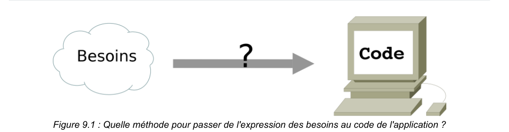
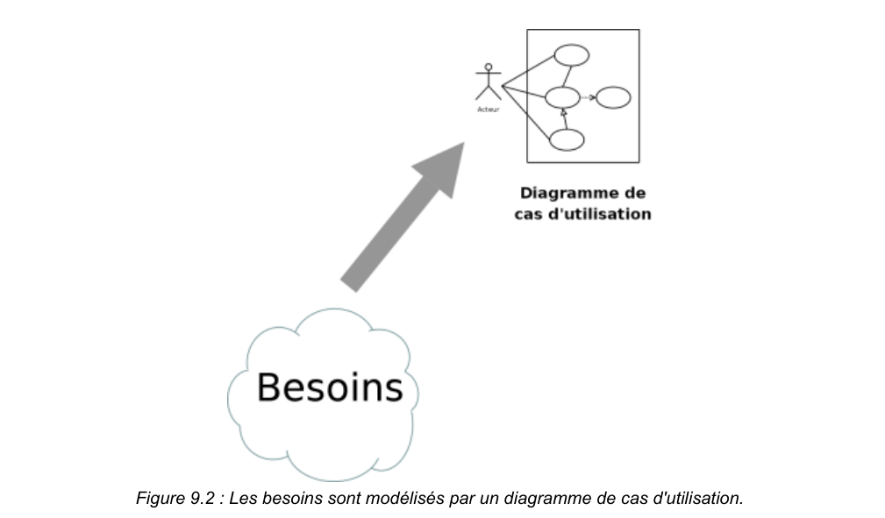
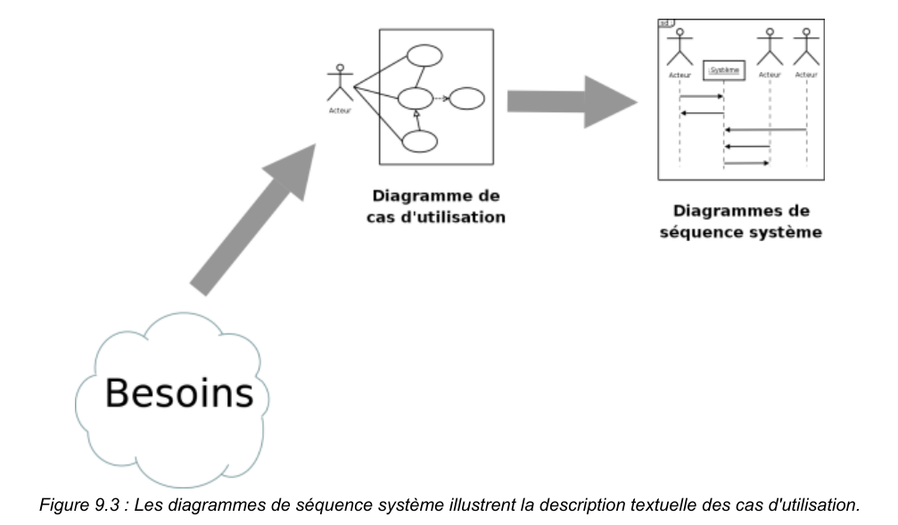
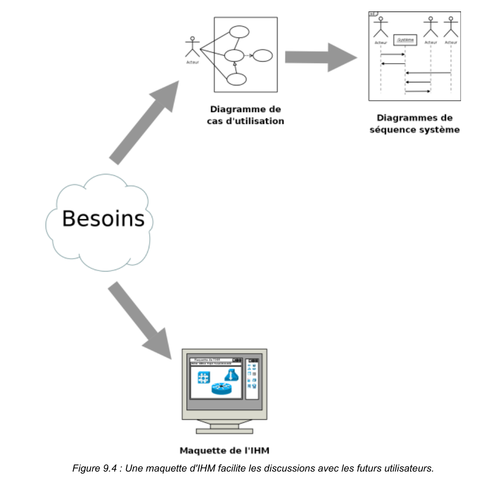
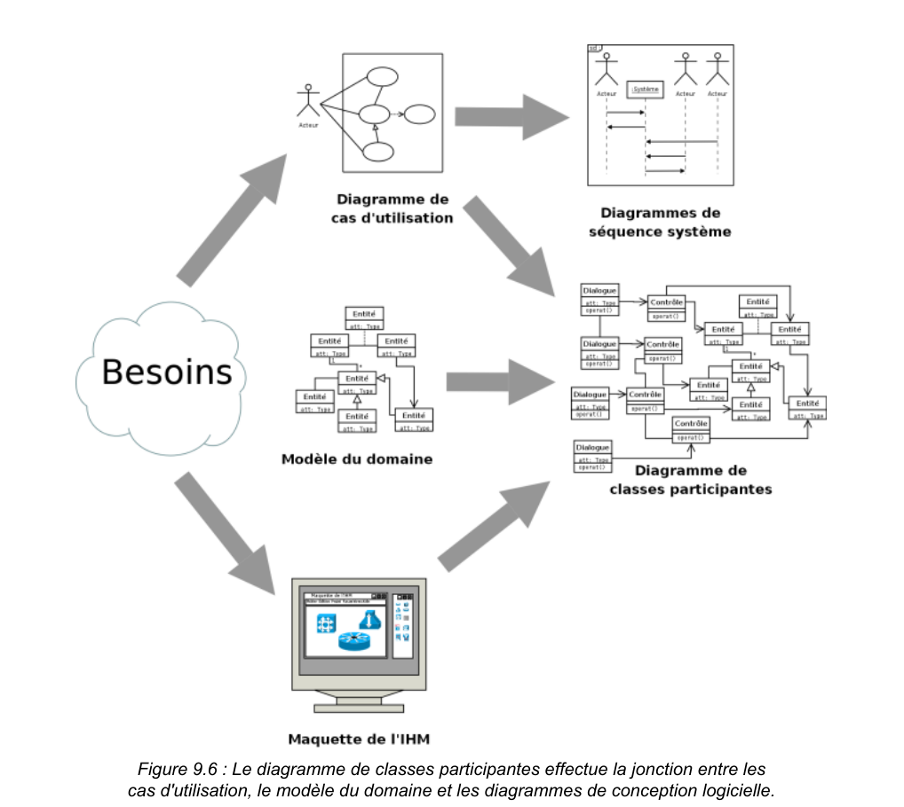
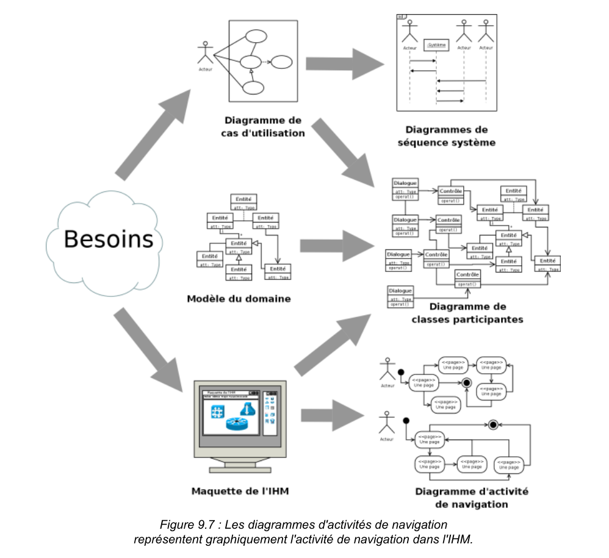
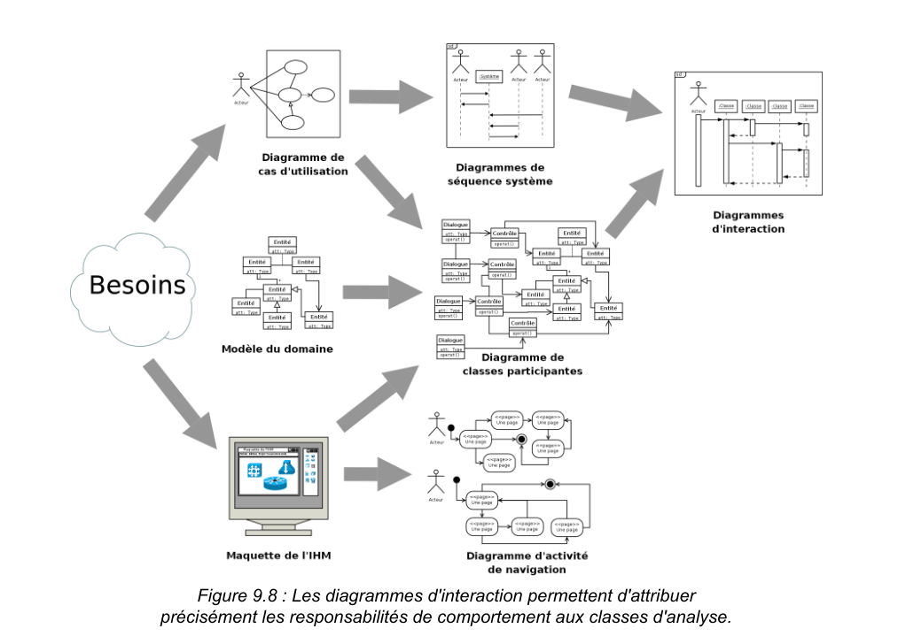
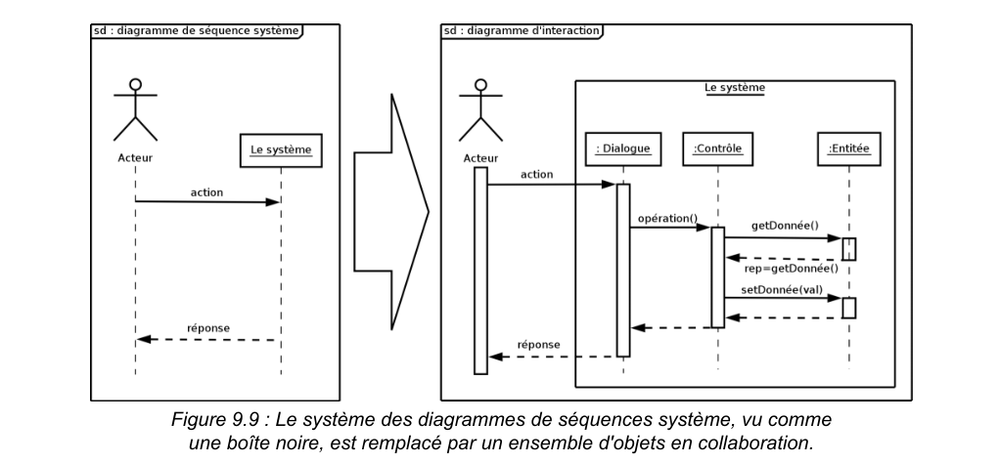
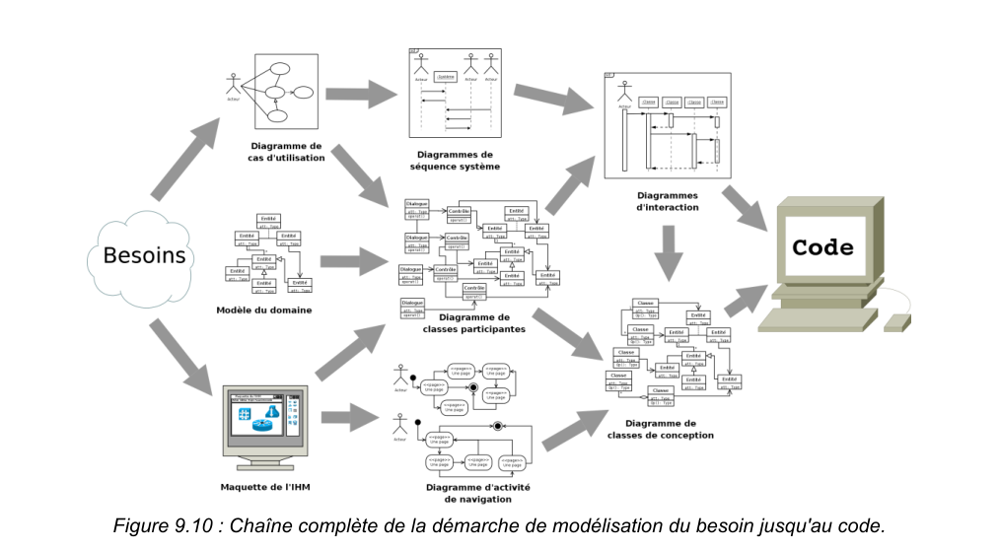

# Démarche UML — Introduction pratique

## De l’expression des besoins au code

UML est un langage de modélisation, pas une méthode. Une démarche outillée par UML doit être pilotée par les cas d’utilisation et centrée sur l’architecture, tout en restant légère. L’objectif: produire un logiciel utile, de qualité, dans des délais et coûts maîtrisés.

## Identification des besoins — Diagrammes de cas d’utilisation

On délimite le système, on identifie acteurs et cas d’utilisation, puis on priorise selon importance et risque. Les cas d’utilisation décrivent les besoins des utilisateurs sans considération technique.

## Diagrammes de séquence système

Ils illustrent la description textuelle des cas d’utilisation en montrant les échanges entre acteurs et le système (vu comme une boîte noire). On modélise au minimum le scénario nominal et, si nécessaire, les variantes majeures.

## Maquette de l’IHM

Une maquette rapide et jetable facilite le dialogue avec les utilisateurs. Elle peut évoluer pour simuler navigation et enchaînements d’écrans, même si les fonctions sont fictives.

## Diagramme de classes participantes

Pont entre besoins et conception. Il distingue Dialogues (IHM), Contrôles (logique d’application) et Entités (domaine), et organise leurs relations pour préserver l’indépendance du domaine vis-à-vis de l’interface.

## Diagrammes d’activités de navigation

Ils représentent la navigation IHM (fenêtres, menus, dialogues…). La modélisation est souvent structurée par acteur et reliée aux classes de dialogue.

## Diagrammes d’interaction (conception)

On alloue précisément les responsabilités aux classes d’analyse via des séquences/communications. Ces diagrammes matérialisent qui fait quoi dans un scénario et préparent la conception détaillée.

## De la boîte noire aux objets en collaboration

Le ‘système’ des séquences système est remplacé par un ensemble d’objets (Dialogues, Contrôles, Entités) qui collaborent. Les interactions doivent respecter les associations et leur navigabilité.

## Diagramme de classes de conception

Vue statique destinée à l’implémentation: on complète opérations, visibilités et détails internes des classes. La première ébauche se raffine en parallèle des diagrammes d’interaction, indépendamment des choix techniques.

## Récapitulatif

1) Cas d’utilisation 
2) Séquences système 
3) Maquette IHM 
4) Modèle du domaine 
5) Classes participantes (Dialogues/Contrôles/Entités) 
6) Interactions (séquences) 
7) Classes de conception (prêtes pour l’implémentation).

## Conseils pratiques
- Modélisez juste ce qu’il faut: privilégiez la clarté et la traçabilité des décisions.
- Tissez les liens entre artefacts (un cas d’utilisation doit se retrouver en séquences, puis en classes participantes, etc.).
- Impliquez les utilisateurs tôt via la maquette et itérez selon importance/risque.
