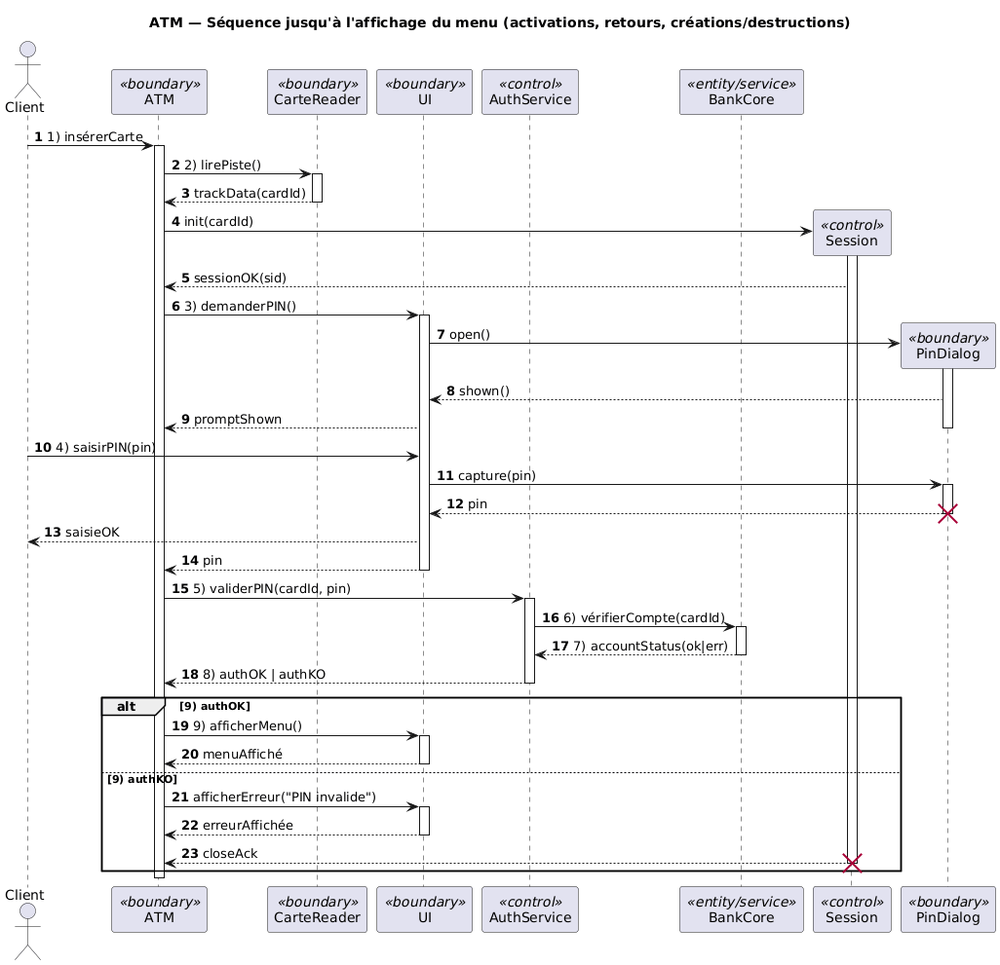

# Diagramme de Séquence (UML)

## 1. Objectifs et positionnement
- Finalité: montrer, dans l’ordre temporel, les échanges de messages entre des participants (objets, composants, acteurs) pour réaliser un scénario.
- Quand l’utiliser:
  - Décrire un cas d’utilisation « fil rouge ».
  - Valider des interfaces, contrats et enchaînements (API, services).
  - Analyser la performance perçue (latences, parallélisme).
- Complémentarités:
  - Avec un diagramme d’activités: « quoi » faire et flux; le diagramme de séquence: « qui parle à qui » et « quand ».
  - Avec un diagramme d’états: états internes vs. interactions externes.

## 2. Notation de base
- Participants (Lifelines):
  - Représentent acteurs, objets, systèmes (« FrontApp », « ATM », « BanqueCore », « Journal »…).
  - Notation: rectangle nommé en haut, ligne de vie en pointillés vers le bas.
  - Stéréotypes courants: « boundary », « control », « entity »; ou domaines « UI », « Service », « DB ».
- Activation (Execution Specification):
  - Barres verticales sur la ligne de vie indiquant qu’un participant exécute du traitement.
- Messages:
  - Synchronous call: flèche pleine, tête pleine; le caller attend la réponse.
  - Asynchronous signal: flèche en trait plein, tête ouverte; pas d’attente de réponse.
  - Return: flèche en pointillés, souvent avec valeur de retour.
  - Create: message de création (stéréotype « create ») vers un participant naissant; la ligne de vie démarre au point d’impact.
  - Destroy: croix « X » à la fin de la ligne de vie.
  - Self-message: flèche qui revient sur la même ligne de vie (récursivité, traitement interne).
  - Lost/Found: message perdu/trouvé si l’émetteur ou le récepteur est inconnu/hors diagramme.
- Ordonnancement:
  - Le temps descend. Les messages plus bas arrivent plus tard.
  - Plusieurs messages peuvent être partiellement ordonnés avec des fragments combinés (voir §4).

## 3. Données, contraintes et temps
- Paramètres et valeurs:
  - Noter les arguments sur l’étiquette du message: validerPIN(pin: ****).
  - Noter les résultats sur la flèche de retour: ok, errCode, token…
- Gardes:
  - [condition] placée avant le nom de message ou sur une transition dans un fragment alt/opt.
- Temps:
  - Delays/Timeouts: after(30s), timeout, SLA ≤ 200 ms.
  - Observations: {ts=t()} pour marquer une prise de temps; durée: {duration ≤ 2s}.
  - Messages temporisés: « after t », « at t », « every T » (utile pour polling/heartbeat).

## 4. Fragments combinés (Combined Fragments)
- alt: alternatives exclusives, chaque opérande avec sa garde.
- opt: optionnel (équivalent à alt avec un seul opérande conditionnel).
- loop: itération avec bornes (min/max), condition, ou « for each ».
- par: exécution en parallèle logique de plusieurs opérandes.
- break: rompt le flot courant (terminaison du scénario si la garde est vraie).
- critical: section critique (exclusion mutuelle).
- region (séquence/strict): contrôlent l’ordre strict vs partiel.
- ref (Interaction Use): inclusion/référence d’une autre interaction (réutilisation).
- neg: scénario négatif interdit (documente un anti-cas).
- assert: ce qui suit doit être le seul comportement valide pour ce contexte.
- consider/ignore: focaliser/masquer des catégories de messages pour la lecture.

## 5. Bonnes pratiques
- Nommer clairement les participants et messages; préférer verbe à l’infinitif: vérifierPIN(), débiter().
- Montrer les activations; aligner visuellement pour révéler le couplage.
- Limiter la largeur: regrouper via ref les interactions secondaires (authentification, journalisation).
- Montrer les retours significatifs (valeur, code, exception).
- Documenter les timeouts/erreurs via alt/break; éviter les « happy paths » uniquement.
- Pour l’asynchrone: indiquer les corrélations (correlationId, conversationId) sur les messages.
- Séparer responsabilités: boundary (UI), control (orchestration), entity (données).
- Garder le diagramme lisible: 10–15 participants max par diagramme; scinder sinon.

## 6. Erreurs fréquentes
- Oublier les conditions d’erreur/timeout.
- Mélanger « qui » exécute (séquence) avec « comment » l’algorithme interne fonctionne (activité/états).
- Utiliser asynchrone quand une réponse est requise immédiate (et inversement).
- Ne pas montrer la création/destruction d’objets éphémères (sessions, transactions).
- Accumuler du texte non structuré au lieu d’utiliser alt/opt/loop.

## 7. Démarche pas à pas (méthode)
- Étape 1: Identifier le scénario (cas d’utilisation, pré/post-conditions).
- Étape 2: Lister les participants et leurs responsabilités.
- Étape 3: Rédiger la conversation nominale (happy path) en 5–12 messages.
- Étape 4: Ajouter les variations: erreurs, timeouts, annulation, re-essai.
- Étape 5: Introduire des fragments alt/opt/loop/par pertinents.
- Étape 6: Noter les temps/SLAs et valeurs clés sur les messages.
- Étape 7: Factoriser via ref les sous-interactions réutilisables.
- Étape 8: Vérifier lisibilité, cohérence, et alignement avec les exigences.

## 8. Exemple centré ATM (Distributeur de billets)
Participants typiques:
- Client (acteur), ATM (boundary), CarteReader (boundary), UI (boundary), AuthService (control), BankCore (entity/service), CashDispenser (boundary), Journal (entity/log), Notifier (service asynchrone).

Description du scénario (retrait):
- 1) Client -> ATM: insérerCarte
- 2) ATM -> CarteReader: lirePiste()
- 3) ATM -> UI: demanderPIN()
- 4) Client -> UI: saisirPIN(pin)
- 5) ATM -> AuthService: validerPIN(cardId, pin) [sync]
- 6) AuthService -> BankCore: vérifierCompte(cardId) [sync]
- 7) BankCore --> AuthService: ok/err
- 8) AuthService --> ATM: authOK | authKO
- 9) ATM -> UI: afficherMenu()
- 10) Client -> UI: choisirRetrait(montant)
- 11) ATM -> BankCore: débiter(compte, montant) [timeout 2s]
- 12) alt
  - [soldeOK]: BankCore --> ATM: débitOK(txId); ATM -> CashDispenser: délivrer(montant)
  - [soldeInsuffisant]: BankCore --> ATM: rejet(code=NSF); break
- 13) par
  - Op1: ATM -> Journal: log(txId, statut)
  - Op2: ATM -> Notifier: publishEvent(txId) [async]
- 14) ATM -> UI: afficherReçu? [opt]; Client -> ATM: prendreBillets; ATM -> CarteReader: éjecterCarte()

## 9. Diagramme de séquence authentification ATM




Importer le code plantUML ci-dessous :
- dans draw.io Arrange / Insert / Advanced / PlantUML
- dans PlantUML: https://editor.plantuml.com/

```
@startuml
autonumber
title ATM — Séquence jusqu'à l'affichage du menu (activations, retours, créations/destructions)

actor Client
participant ATM <<boundary>>
participant CarteReader <<boundary>>
participant UI <<boundary>>
participant AuthService <<control>>
participant BankCore <<entity/service>>

' Objets temporaires (créés à l'exécution)
participant Session as Sess <<control>>
participant PinDialog as PD <<boundary>>

' 1) Insertion carte
Client -> ATM: 1) insérerCarte
activate ATM

' 2) Lecture de la piste
ATM -> CarteReader: 2) lirePiste()
activate CarteReader
CarteReader --> ATM: trackData(cardId)
deactivate CarteReader

' Création d'une session temporaire liée à la carte
create Sess
ATM -> Sess: init(cardId)
activate Sess
Sess --> ATM: sessionOK(sid)

' 3) Demander le PIN (UI crée une boîte de dialogue temporaire)
ATM -> UI: 3) demanderPIN()
activate UI
create PD
UI -> PD: open()
activate PD
PD --> UI: shown()
UI --> ATM: promptShown
deactivate PD

' 4) Saisie du PIN par le client
Client -> UI: 4) saisirPIN(pin)
UI -> PD: capture(pin)
activate PD
PD --> UI: pin
destroy PD
UI --> Client: saisieOK
UI --> ATM: pin
deactivate UI

' 5) Validation du PIN côté AuthService
ATM -> AuthService: 5) validerPIN(cardId, pin)
activate AuthService

' 6) Vérification du compte dans le cœur bancaire
AuthService -> BankCore: 6) vérifierCompte(cardId)
activate BankCore
BankCore --> AuthService: 7) accountStatus(ok|err)
deactivate BankCore

' 8) Résultat d'authentification
AuthService --> ATM: 8) authOK | authKO
deactivate AuthService

' 9) Affichage du menu si authentifié; sinon fin de scénario (session détruite)
alt 9) authOK
  ATM -> UI: 9) afficherMenu()
  activate UI
  UI --> ATM: menuAffiché
  deactivate UI
else 9) authKO
  ATM -> UI: afficherErreur("PIN invalide")
  activate UI
  UI --> ATM: erreurAffichée
  deactivate UI
  Sess --> ATM: closeAck
  destroy Sess
end

deactivate ATM
@enduml
```


