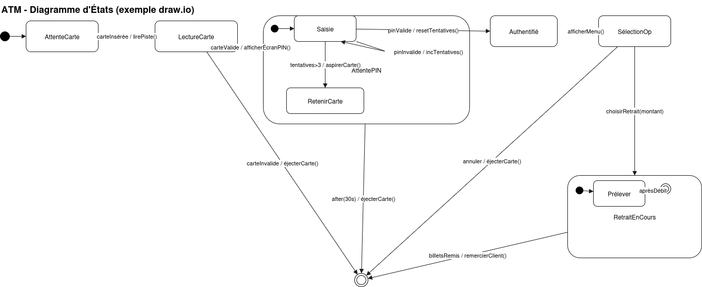

# Diagramme d’États-Transitions (UML)

## 1) Objectifs et quand l’utiliser
- Décrire le cycle de vie d’un objet ou d’un système réactif en fonction des événements reçus.
- Rendre explicites les règles de transition, les conditions (gardes), les actions et les états stables.
- Cas d’usage typiques: automates, protocoles (cartes à puce, réseaux), UI/écrans, objets métier à fort cycle de vie.

---

## 2) Éléments de base (notation UML)
- État (State): condition/stade stable du système. Peut définir:
  - entry / exit actions: actions exécutées à l’entrée/sortie de l’état.
  - doActivity: activité qui s’exécute tant que l’état est actif (interrompable par événement).
  - invariant: contrainte vraie tant que l’état est actif.
- Transition: lien orienté entre états, déclenché par un événement.
  - Syntaxe: `source —event [garde] / action—> cible`
  - Garde: expression booléenne; si fausse, la transition n’est pas prise.
  - Action d’effet: traitement immédiat quand la transition est franchie.
- Événement: déclencheur; types fréquents:
  - Événement de signal (asynchrone), d’appel (appel d’opération), de changement (condition devient vraie), de temps (après t, à t).
- États initiaux et finaux:
  - Pseudo-état initial: point de départ (disque plein).
  - État final: fin du comportement pour l’instance (cible cerclée).
- Pseudo-états supplémentaires:
  - Choice/Junction (décision/jonction), History (H / H*), Fork/Join (parallélisme dans états orthogonaux), Terminate (fin immédiate).

---

## 3) États composés et hiérarchie
- État composite: contient des sous-états (région interne) et un pseudo-état initial local.
- Histoire (History):
  - Shallow H: revient au dernier sous-état actif du niveau courant.
  - Deep H*: revient au dernier sous-état actif récursif.
- Orthogonalité (concurrence):
  - Un état composite peut contenir plusieurs régions orthogonales actives en parallèle.
  - Synchronisation via événements communs, transitions, ou Join à l’extérieur.

---

## 4) Cycles de vie, événements et temps
- Transitions temporisées:
  - `after(30s)`: timeout après 30 secondes dans l’état.
  - `at(12:00)`: déclenchement à une date/heure (rare dans modèles génériques).
- Événements différés (deferred): l’état peut mettre en attente certains événements pour les traiter plus tard.
- Transitions de complétion: transitions sortantes sans événement, déclenchées quand l’activité interne est terminée et la garde vraie.

---

## 5) Notation détaillée (rappel de syntaxe)
- État:
  - Titre au présent/adjectival (p.ex. « Attente PIN », « Authentifié », « Maintenance »).
  - Section interne optionnelle:
    ```
    state "Attente PIN" as AttentePIN {
      entry / afficherÉcranPIN()
      do / chronométrer()
      exit / nettoyerBuffer()
    }
    ```
- Transition:
  - `AttentePIN --> Authentifié : pinValide [tentatives &lt;= 3] / resetCompteur()`
  - `AttentePIN --> RetenirCarte : after(30s) / aspirerCarte()`

---

## 6) Démarche de modélisation (pas à pas)
1) Définir le périmètre: quel objet/système est modélisé (ex.: « SessionATM »).
2) Lister les événements observables: insertion carte, saisie PIN, annulation, timeout, signaux du système bancaire, etc.
3) Identifier les états stables: AttenteCarte, AttentePIN, Authentifié, SélectionOp, RetraitEnCours, FinSession, Maintenance.
4) Spécifier les transitions:
   - Événement déclencheur, garde (si nécessaire), action d’effet, état cible.
5) Gérer les erreurs/timeout:
   - États d’exception (Bloqué), transitions temporisées (after), annulation utilisateur.
6) Factoriser via états composés:
   - Grouper « Authentification » (AttentePIN + Vérification) avec une histoire en cas de reprise.
7) Vérifier l’exhaustivité:
   - Toute combinaison « état actif + événement plausible » a-t-elle un comportement défini ?
8) Simuler des scénarios et supprimer les ambiguïtés:
   - Contradictions de gardes, transitions concurrentes non déterministes, actions redondantes.

---

## 7) Bonnes pratiques
- Noms d’états concis et significatifs; éviter les verbes d’action au passé (préférer conditions stables).
- Préférer une garde par cas plutôt que de multiplier les transitions ambiguës.
- Centraliser les effets récurrents dans entry/exit quand possible.
- Limiter le nombre d’états; regrouper via états composites.
- Documenter les hypothèses de temps (unités, horloge).
- Rendre visibles les événements différés et les timeouts.

---

## 8) Erreurs courantes
- Oublier une transition pour un événement plausible => deadlock ou perte d’événement.
- Utiliser des transitions de complétion là où un événement est requis (comportement inattendu).
- Multiplier les gardes qui se chevauchent sans priorité => non déterminisme.
- Confondre « Flow Final » des activités avec « Terminate » en machine d’états.
- Omettre l’état final quand il est nécessaire pour signifier la fin de vie de l’objet.

---

## 9) Exemple fil rouge: Session d’un ATM
Objet modélisé: `SessionATM` (du moment où la carte est insérée à la restitution de la carte).

États principaux:
- `AttenteCarte` (initial) → `LectureCarte` → `AttentePIN` → `Authentifié` → `SélectionOp` → `RetraitEnCours` → `FinSession` (final)
- Transitions d’exception: `AttentePIN -- after(30s) --> ÉjecterCarte`, `AttentePIN -- pinInvalide / incTentatives() --> AttentePIN`, `AttentePIN -- tentatives>3 --> RetenirCarte`.
- État composite `Transaction` contenant `PréparationBillets` et `ImpressionReçu` en régions orthogonales; synchronisation avant `Remise`.

Pseudo-états utiles:
- `Choice`: décision sur solde suffisant.
- `History (H)`: reprise dans `SélectionOp` si l’écran se rafraîchit après une interruption mineure.

---

## 10) Exemple DAB



---

## 11) Check-list de relecture
- États nommés clairement, un seul sens par état.
- Pour chaque événement plausible et chaque état, un comportement est spécifié.
- Gardes exhaustives et mutuellement exclusives, ou priorité définie.
- Timeouts et événements différés documentés.
- Actions placées au bon niveau (entry/exit/transition).
- Concurrence maîtrisée (orthogonalité nécessaire et synchronisée).

---

## 12) Glossaire
- État: condition durable.
- Transition: passage d’un état à un autre.
- Événement: déclencheur du passage.
- Garde: condition qui autorise/empêche la transition.
- entry/exit/do: actions associées à un état.
- Pseudo-état: élément de contrôle (initial, choice, history, fork/join, terminate).
- H/H*: mémoire de sous-état local/profond.
- Orthogonalité: exécution parallèle dans un état composite.

