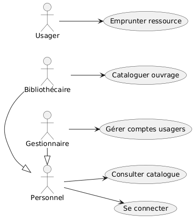
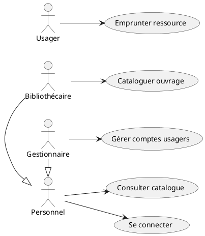
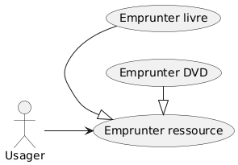
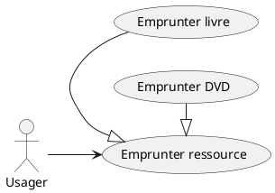
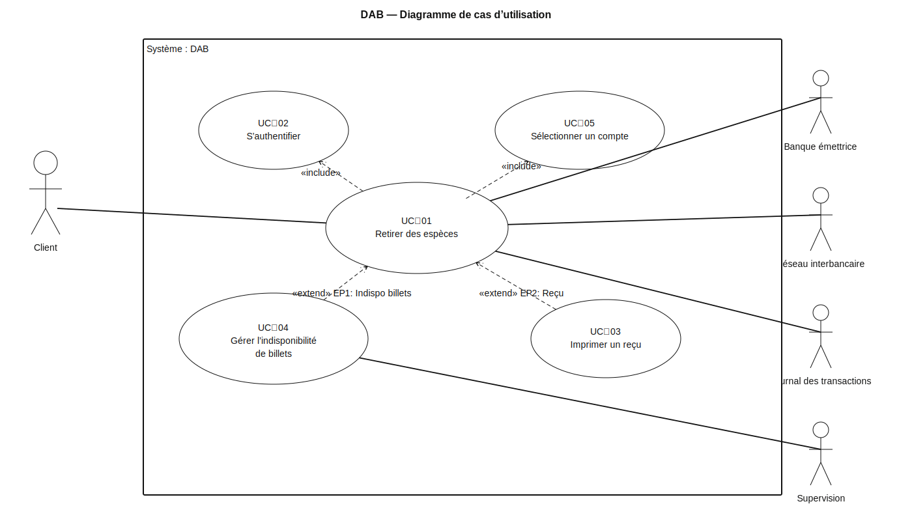

# Diagrammes de Cas d’Utilisation (UML Use Case)

## 1. Finalité et positionnement

- Un diagramme de cas d’utilisation (Use Case) répond à la question : « Quelles fonctionnalités le système doit-il offrir à quels acteurs, et pourquoi ? »
- Il capture le **quoi** (exigences fonctionnelles vues de l’extérieur), pas le **comment** (implémentation).
- Il sert à :
  - Aligner l’équipe sur le **périmètre** du système.
  - Faciliter la **communication** avec les parties prenantes non techniques.
  - Poser la base pour la **priorisation** et la **traçabilité** des exigences.

---

## 2. Vocabulaire et éléments de base

- **Système (System Boundary)** : la boîte représentant la solution étudiée. Tout ce qui est **dans** la boîte est fourni par le système.
- **Acteur** :
  - Représente un rôle (humain, autre système, dispositif) qui interagit avec le système.
  - Types :
    - Acteur **primaire** : bénéficie directement du service (p. ex. « Adhérent »).
    - Acteur **secondaire** : fournit un service au système (p. ex. « Service de Paiement »).
  - Un acteur ≠ une personne : c’est un **rôle**. Une même personne peut tenir plusieurs rôles.
- **Cas d’utilisation (Use Case)** :
  - Une capacité fournie par le système qui délivre une valeur mesurable à un acteur.
  - Doit être **observable** de l’extérieur et produire un **résultat d’intérêt**.

---

## 3. Relations UML spécifiques

- **Association (Acteur ↔ UC)** : indique une interaction.
- **Include** `<<include>>` :
  - Factorise un sous-service commun toujours requis.
  - Le cas inclus est systématiquement exécuté par le cas incluant.
  - Ex. « Payer des frais » peut inclure `<<include>>` « Authentifier l’utilisateur ».
- **Extend** `<<extend>>` :
  - Variante optionnelle conditionnelle (extension d’un comportement principal).
  - S’active si une **condition** (point d’extension) est vraie.
  - Ex. « Appliquer réduction » peut `<<extend>>` « Payer des frais » si l’utilisateur est éligible.
- **Généralisation** (Acteurs ou UC) :
  - Spécialise un rôle ou un service. La généralisation exprime “est-un/est-un cas particulier de”. L’élément spécialisé (enfant) hérite des relations et du comportement de l’élément plus général (parent), puis ajoute ou restreint des capacités.
  - Ex. Acteur « Personnel » généralisé en « Bibliothécaire » et « Gestionnaire ».

### 3.1. Généralisation d’acteurs

- Sens: spécialiser un rôle vis‑à‑vis du système.
- Héritage: l’acteur enfant hérite de toutes les associations (liens) du parent vers les UC.
- Quand l’utiliser:
  - Un rôle A fait tout ce que fait RôleGénéral, plus des actions supplémentaires.
  - Vous voulez éviter de dupliquer les mêmes liens vers de nombreux UC.
- À éviter:
  - Refléter la hiérarchie RH de l’entreprise (on modélise des rôles, pas des postes).
  - Créer une généralisation si les rôles n’ont pas de comportements communs significatifs.

Exemple “Personnel” généralisé en “Bibliothécaire” et “Gestionnaire”
- tout “Personnel” peut se connecter et consulter le catalogue.
- “Bibliothécaire” ajoute “Cataloguer ouvrage”.
- “Gestionnaire” ajoute “Gérer comptes usagers”.






### 3.2. Généralisation de cas d’utilisation (UC)

- Sens: un UC enfant est une forme plus spécifique d’un UC parent (même intention globale, scénario plus spécialisé).
- Héritage: l’enfant hérite de la relation aux acteurs et des étapes communes; il précise, restreint ou enrichit des variantes.
- Quand l’utiliser:
  - Vous avez une intention “générique” avec des variantes substantielles et stables.
  - Les UC enfants partagent une grande partie des étapes.
- À ne pas confondre:
  - include: factorise une sous‑fonction obligatoire réutilisable.
  - extend: ajoute un scénario optionnel/conditionnel au parent.
  - généralisation: crée une famille d’UC où l’enfant est “un type particulier de” l’UC parent.

Exemple “Emprunter ressource” spécialisé
- Parent: Emprunter ressource
- Enfants: Emprunter livre, Emprunter DVD (mêmes étapes clés, règles spécifiques selon le type)





Petite grille de décision
- A ou B partagent la majorité des interactions et l’un est un cas particulier de l’autre → généralisation.
- Un bloc d’étapes commun à plusieurs UC, exécuté à chaque fois → include.
- Une variante optionnelle/sous condition d’un scénario → extend.
- Deux rôles différents sans héritage logique de comportements → acteurs séparés, pas de généralisation.

Bénéfices
- Réduction de la duplication (liens et descriptions).
- Modèles plus lisibles: on visualise les capacités communes et les spécialisations.
- Évolution facilitée: un changement dans le parent se propage aux enfants.

### Bonnes pratiques :
- Utiliser `<<include>>` pour la **réutilisation systématique**.
- Utiliser `<<extend>>` pour des **variantes** et **options**.
- Ne pas abuser de la généralisation : préférer la clarté à l’élégance excessive.

---

## 4. Frontières, périmètre et granularité

- Définir clairement :
  - Le **contexte** (quels acteurs existent autour du système ?).
  - Le **périmètre** (ce que le système fait / ne fait pas).
- Granularité :
  - Un cas d’utilisation doit produire un **résultat de valeur** (p. ex. « Emprunter un livre ») plutôt qu’une simple action technique (« Valider formulaire »).
  - Critère de test : l’UC laisse le système dans un **état stable** avec un **post-état** observable.

---

## 5. Identifier acteurs et cas d’utilisation

Approche recommandée (top-down puis bottom-up) :
1. Partir des **objectifs métier** et des **valeurs attendues**.
2. Lister les **acteurs** (humains, systèmes externes, services).
3. Pour chaque acteur primaire, demander : « Quelle valeur obtient-il ? » ⇒ cas d’utilisation candidats.
4. Déduire les **variantes** et **règles** ⇒ `<<extend>>`.
5. Factoriser les **sous-services communs** ⇒ `<<include>>`.
6. Vérifier la **cohérence** inter-UC (chevauchements, doublons, dépendances).
7. Valider le **périmètre** et prioriser.

Heuristiques utiles :
- Parcourir le **cycle de vie** des principaux objets métier (ex. livre, abonnement).
- Examiner les **événements externes** (p. ex. échéance, pénalité).
- Inspecter les **interfaces** existantes (API, services tiers).

---

## 6. Rédiger la description textuelle d’un Use Case

Chaque cas d’utilisation doit être accompagné d’une fiche textuelle normalisée.

Champs recommandés :
- Nom (verbe à l’infinitif + objet) : « Emprunter un livre »
- But / Valeur métier
- Acteurs impliqués (principal, secondaires)
- Préconditions (vraies avant le début)
- Postconditions (vraies après succès)
- Déclencheur (événement initial)
- Scénario nominal (étapes 1..n)
- Scénarios alternatifs / Exceptions (par numérotation liée)
- Règles métier (référencées)
- Données manipulées (références au modèle de domaine)
- Fréquence / Priorité / Risques

Gabarit Markdown (à copier-coller) :
```markdown
## UC-XX — Emprunter un livre

- But : …
- Acteur principal : …
- Acteurs secondaires : …
- Préconditions : …
- Postconditions (succès) : …
- Déclencheur : …

### Scénario nominal
1. …
2. …
3. …

### Scénarios alternatifs / Exceptions
- A1. [Depuis étape X] Condition… → …
- E1. [Depuis étape Y] Erreur… → …

### Règles métier
- RM-1 : …
- RM-2 : …

### Données / Références
- Livre, Adhérent, Emprunt (cf. Dictionnaire/Diagramme de classes)
```

Conseils de rédaction :
- Étapes en **langage métier**, sans solution technique.
- Chaque étape doit être **observable** par un acteur.
- Les erreurs/alternatives doivent pointer l’**étape source**.

---

## 7. Qualité et critères d’acceptation

Critères de qualité d’un diagramme de cas d’utilisation :
- Noms clairs, verbe + complément, **valeur observable**.
- Frontière du système visible et justifiée.
- Acteurs réellement externes (pas de classes internes déguisées).
- Relations `<<include>>` et `<<extend>>` correctement justifiées.
- Couverture des règles métier par au moins un UC.
- Traçabilité : UC ↔ exigences ↔ tests d’acceptation.

Anti‑patterns fréquents :
- UC « techniques » (p. ex. « Se connecter à la base »).
- UC trop granulaires (« Cliquer sur bouton ») ou trop larges (« Gérer la bibliothèque »).
- Acteurs internes au système.
- Multiplication de `<<extend>>` pour simuler des if/else au lieu de rédiger les **scénarios**.

---

## 8. Notation graphique essentielle

- Acteurs : silhouettes (ou rectangles stéréotypés) hors de la frontière.
- Cas d’utilisation : ellipses nommées, à l’intérieur de la frontière.
- Associations : traits simples entre acteur et UC.
- `<<include>>` : flèche pointillée avec stéréotype vers l’UC inclus.
- `<<extend>>` : flèche pointillée avec stéréotype vers l’UC étendu (point d’extension indiqué).
- Généralisation : flèche triangulaire pleine vers l’élément général.

---

## 9. Lien avec le reste du modèle

- Les cas d’utilisation guident :
  - Le **diagramme de classes** (concepts manipulés, responsabilités candidates).
  - Les **diagrammes d’activités** (logique détaillée d’un UC).
  - Les **diagrammes de séquence** (interactions temporelles).
  - Les **diagrammes d’états** (cycle de vie des objets clés).
- Bon flux de travail :
  1. Esquisser les UC + descriptions textuelles.
  2. Déduire les concepts et relations majeures (pré‑modèle de domaine).
  3. Raffiner avec activités/séquences pour les UC critiques.
  4. Boucler par itérations courtes avec les parties prenantes.

---

## 10. Checklist de validation

- [ ] Les acteurs couvrent tous les rôles externes pertinents.
- [ ] Chaque UC produit un résultat utile pour un acteur.
- [ ] Les pré/postconditions sont testables.
- [ ] Les scénarios alternatifs traitent les cas d’erreur réalistes.
- [ ] Les `<<include>>` factorisent des obligations communes.
- [ ] Les `<<extend>>` modélisent de vraies options conditionnelles.
- [ ] Le périmètre est clair, sans UC « boîte noire magique ».
- [ ] La terminologie est homogène avec le domaine métier.

---

## 11. Exemple de cas d'utilisation: distributeur automatique de billets

### UC-01 — Retirer des espèces

- But : Permettre au client de retirer une somme en espèces depuis son compte.
- Acteur principal : Client (titulaire de carte)
- Acteurs secondaires : Réseau interbancaire, Banque émettrice, Journal des transactions
- Préconditions : DAB en service ; Carte valide ; Connexion au réseau disponible.
- Postconditions (succès) : Espèces délivrées ; Compte débité ; Transaction journalisée.
- Déclencheur : Le client insère sa carte pour retirer de l’argent.

#### Scénario nominal
1. Le client insère sa carte ; le DAB lit la carte et affiche l’écran d’accueil.
2. « Inclut » UC-02 — S’authentifier (vérification PIN et statut carte).
3. « Inclut » UC-05 — Sélectionner un compte (si la carte rattache plusieurs comptes).
4. Le client saisit le montant à retirer.
5. Le DAB vérifie la provision et le plafond de retrait quotidien avec la banque émettrice.
6. Le DAB vérifie la disponibilité des billets pour composer le montant.
   - [Point d’extension EP1 — Indisponibilité de billets] : Peut déclencher UC-04 — Gérer l’indisponibilité de billets.
7. Le DAB débite le compte et journalise la transaction.
8. Le DAB distribue les billets et restitue la carte.
9. [Point d’extension EP2 — Reçu] : Peut déclencher UC-03 — Imprimer un reçu (si le client le demande ou si la banque l’impose).
10. Le DAB termine la session.

#### Scénarios alternatifs / Exceptions

- A1. [Depuis étape 4] Le client choisit une somme prédéfinie (ex. 20/50/100 €) → Aller en 5.
- A2. [Depuis étape 5] Provision insuffisante mais autorisation de découvert → Continuer en 6 avec le découvert autorisé.
- E1. [Depuis étape 2] Échec d’authentification (3 PIN erronés) → Carte avalée, session terminée.
- E2. [Depuis étape 5] Provision insuffisante et aucun découvert → Message “Fonds insuffisants”, fin de session.
- E3. [Depuis étape 7] Échec de débit/reply time-out → Annulation transaction et message d’échec, fin de session.

#### Règles métier
- RM-1 : Le montant demandé doit respecter le plafond quotidien et les limites par opération fixés par la banque.
- RM-2 : La composition des billets doit correspondre aux cassettes disponibles (dénominations/priorités).
- RM-3 : En cas d’échec post‑débit, une opération de réconciliation (auto-reverse) est déclenchée.
- RM-4 : Le reçu est optionnel sauf cas réglementaires (ex. transactions interbancaires > seuil).

#### Données / Références
- Carte, Client, Compte, Autorisation, Plafond, Billet, Cassette, Transaction, Journal, Banque émettrice, Paramètres DAB.


### UC-02 — S’authentifier  (Use case inclus par UC-01, UC-06, etc.)

- But : Vérifier l’identité du client avant toute opération sensible.
- Acteur principal : Client
- Acteurs secondaires : Banque émettrice
- Préconditions : Carte insérée et lisible.
- Postconditions (succès) : Client authentifié pour la session en cours.
- Déclencheur : Le DAB demande le code PIN.

#### Scénario nominal
1. Le DAB invite le client à saisir le PIN.
2. Le client saisit le PIN ; le DAB masque l’entrée.
3. Le DAB compare localement (carte à puce) et/ou sollicite la banque pour vérifier le PIN/état carte.
4. Authentification validée ; poursuite du cas appelant.

#### Scénarios alternatifs / Exceptions
- A1. [Depuis étape 1] Le client insère une carte avec authent biométrique activée → Capture biométrique puis vérification.
- E1. [Depuis étape 3] PIN erroné (tentative < 3) → Reboucler à l’étape 1.
- E2. [Depuis étape 3] PIN erroné (3e tentative) → Carte avalée, session terminée.

#### Règles métier
- RM-1 : Nombre maximal de tentatives consécutives = 3.
- RM-2 : L’authentification réussie ouvre une fenêtre de session (timeout d’inactivité configurable).

#### Données / Références
- Carte (PAN, AID), PIN offset, Compte(s) liés, Paramètres sécurité, Journal.


### UC-03 — Imprimer un reçu  (Use case en extension de UC-01)

- But : Fournir un justificatif de l’opération au client.
- Acteur principal : Client
- Acteurs secondaires : Journal des transactions
- Préconditions : UC-01 atteint le point d’extension EP2 — Reçu ; imprimante opérationnelle.
- Postconditions (succès) : Reçu imprimé et, le cas échéant, envoyé en version numérique (si service activé).
- Déclencheur : Choix explicite du client (“Oui, imprimer un reçu”) ou règle de la banque.

#### Scénario nominal
1. Le DAB propose l’impression du reçu.
2. Le client accepte ; le DAB génère les détails (montant, date/heure, terminal, solde estimé).
3. Le DAB imprime le reçu et met à jour le journal.

#### Scénarios alternatifs / Exceptions
- A1. [Depuis étape 1] Le client refuse → Fin de l’extension sans impact sur UC-01.
- E1. [Depuis étape 3] Plus de papier / imprimante en défaut → Afficher message et offrir reçu dématérialisé si disponible.

#### Règles métier
- RM-1 : Le solde imprimé peut être “solde estimé” selon la latence de compensation.
- RM-2 : Les mentions légales (identifiant du DAB, horodatage, montant) sont obligatoires.

#### Données / Références
- Transaction, Solde estimé, Paramètres d’impression, Journal, Préférences client (reçu numérique).

### UC-04 — Gérer l’indisponibilité de billets  (Use case en extension de UC-01)

- But : Traiter le cas où la somme demandée ne peut pas être fournie avec les billets disponibles.
- Acteur principal : Client
- Acteurs secondaires : Supervision DAB (télémétrie)
- Préconditions : UC-01 atteint le point d’extension EP1 — Indisponibilité de billets.
- Postconditions (succès) : Le client retire un montant ajusté ou l’opération est annulée proprement.
- Déclencheur : Le calcul de composition des billets échoue pour le montant demandé.

#### Scénario nominal
1. Le DAB informe le client de l’indisponibilité pour le montant exact.
2. Le DAB propose des montants alternatifs réalisables (ex. 40 €, 60 €, 100 €).
3. Le client choisit un montant alternatif.
4. Retour vers UC-01 à l’étape 7 (débit et distribution).

#### Scénarios alternatifs / Exceptions
- A1. [Depuis étape 2] Le client choisit “Annuler” → UC-01 se termine sans débit.
- E1. [Depuis étape 3] Aucun montant alternatif possible → UC-01 se termine, consigne envoyée à la supervision.

#### Règles métier
- RM-1 : Les propositions tiennent compte des cassettes actives et des priorités de distribution.
- RM-2 : Les logs doivent tracer l’impossibilité de composer le montant demandé.

#### Données / Références
- Cassette, Billet, Politique de composition, Journal, Événements supervision.


### UC-05 — Sélectionner un compte  (Use case inclus par UC-01)

- But : Permettre au client de choisir le compte à débiter quand plusieurs comptes sont liés à la carte.
- Acteur principal : Client
- Acteurs secondaires : Banque émettrice
- Préconditions : Authentification réussie ; plusieurs comptes disponibles pour la carte.
- Postconditions (succès) : Compte source sélectionné pour l’opération appelante.
- Déclencheur : Le DAB détecte plusieurs comptes éligibles.

#### Scénario nominal
1. Le DAB affiche la liste des comptes (ex. Chèque, Épargne) avec leurs alias.
2. Le client sélectionne un compte.
3. Le DAB confirme la sélection au cas appelant.

##### Scénarios alternatifs / Exceptions
- A1. [Depuis étape 1] Un compte est pré‑défini par préférence client → Sélection automatique.
- E1. [Depuis étape 1] Aucune réponse (timeout) → Annulation et retour à l’écran d’accueil.

##### Règles métier
- RM-1 : Seuls les comptes autorisés aux retraits DAB sont listés.
- RM-2 : L’ordre d’affichage peut être imposé par la banque/ICCB.

##### Données / Références
- Carte, Liste des comptes, Préférences client, Paramètres d’affichage.




---

## 12. Modèle de livrable attendu (résumé)

- Un diagramme global des cas d’utilisation avec frontière du système.
- Une fiche textuelle par UC (gabarit fourni plus haut).
- Justification brève de chaque `<<include>>` / `<<extend>>`.
- Liste des règles métier référencées (RM‑x) et leur couverture par les UC.

